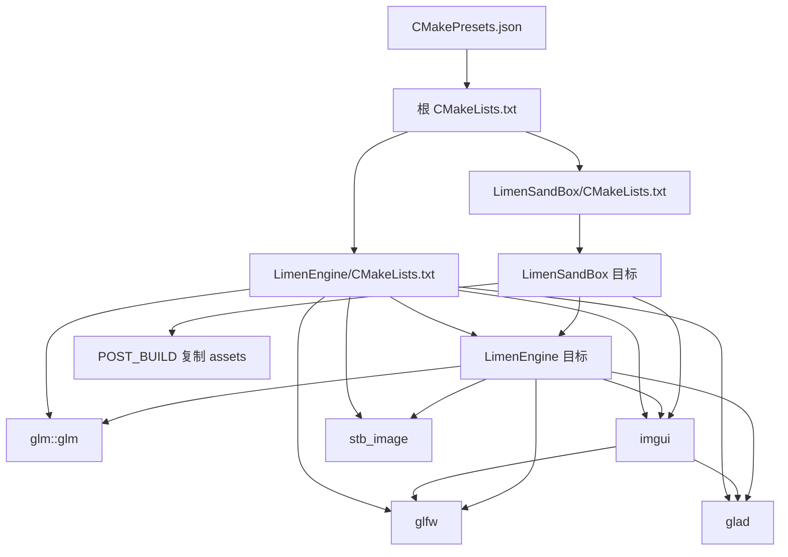

# Limen Engine

Limen Engine 是一个用于学习并逐步实现现代实时渲染架构的 C++20 游戏引擎项目。当前重点是建立清晰的 Application、Renderer、RHI、RenderPass、GraphicsPipeline 与 Editor 分层，并以 macOS OpenGL 4.1 后端验证设计；后续计划加入 macOS Metal 与 Windows Direct3D 11/12 后端。

## 当前状态

| 操作系统 | 图形 API | 状态 |
| --- | --- | --- |
| macOS | OpenGL 4.1 | 已实现，当前默认后端 |
| macOS | Metal | 规划中 |
| Windows | Direct3D 11 | 规划中 |
| Windows | Direct3D 12 | 规划中 |
| Linux | OpenGL / Vulkan | 规划中 |
| iOS | Metal | 远期规划 |
| Android | Vulkan | 远期规划 |

当前 CMake 会在 Windows 与 Linux 配置阶段明确报错，因为这些平台后端尚未落地。`RendererAPI::API` 中的枚举表示架构预留，不等于对应后端已经可以构建。

Windows 版本计划只支持 Direct3D 11/12，不提供 Windows OpenGL 后端；macOS 计划允许在 OpenGL 与 Metal 之间选择。

## 获取与构建

### 环境要求

- CMake 4.0 或更高版本；
- 支持 C++20 的编译器；
- Ninja；
- Git（用于初始化 submodule）；
- macOS 当前需要可用的 OpenGL 4.1 与 Cocoa 窗口环境。

初始化第三方 submodule：

```bash
git submodule update --init --recursive
```

配置并构建 macOS Debug 版本：

```bash
cmake --preset ninja-debug
cmake --build --preset build-debug
```

运行：

```bash
./out/LimenSandBox
```

构建目录、最终程序与开发期资源副本分别位于：

```text
out/cmake-build-debug-clang++/   # Ninja 构建树和 CMakeCache.txt
out/LimenSandBox                 # 最终可执行文件
out/assets/                      # POST_BUILD 复制的 Sandbox 资源
```

### 可用 Preset

| 配置 | Configure Preset | Build Preset | 引擎类型 | Sanitizer |
| --- | --- | --- | --- | --- |
| Debug | `ninja-debug` | `build-debug` | Static | ASan + UBSan |
| Shared Debug | `ninja-shared-debug` | `build-shared-debug` | Shared | ASan + UBSan |
| Release | `ninja-release` | `build-release` | Static | 关闭 |

`cmake --preset` 接收 Configure Preset；`cmake --build --preset` 接收 Build Preset，两者名称不能混用。

## 当前目录结构

```text
Limen-Engine/
├── CMakeLists.txt                       # 项目级标准、选项和统一编译策略
├── CMakePresets.json                    # Debug/Release 构建入口
├── README.md
│
├── LimenEngine/
│   ├── CMakeLists.txt                   # 引擎库、第三方目标与平台源文件边界
│   ├── include/
│   │   ├── Limen.h                     # Sandbox 使用的公共聚合头
│   │   └── Limen/
│   │       ├── Application/            # Application、Window、LayerStack
│   │       ├── Core/                   # Scope/Ref、日志、断言、DeltaTime
│   │       ├── Events/                 # 窗口、键盘与鼠标事件
│   │       ├── Input/                  # 跨平台输入查询与统一键码
│   │       ├── Renderer/               # Camera、Renderer、RenderPass
│   │       ├── RHI/                    # 公共 GPU 资源与 Pipeline 抽象
│   │       ├── EntryPoint.h            # 客户端程序入口
│   │       └── lmpch.h                 # 仅引擎内部使用的 PCH
│   ├── src/
│   │   ├── Application/
│   │   ├── Core/
│   │   ├── Editor/ImGui/               # 引擎私有 ImGui Layer
│   │   ├── Platform/
│   │   │   ├── GLFW/                   # 输入查询与键码转换
│   │   │   └── macOS/                  # MacWindow
│   │   ├── Renderer/                   # 高层场景提交与 RenderPass 实现
│   │   └── RHI/
│   │       ├── Common/                 # 后端工厂与 API 无关实现
│   │       └── macOS/OpenGL/           # 当前 OpenGL 后端实现
│   └── vendor/                         # GLAD、GLFW、GLM、ImGui、spdlog、stb_image
│
└── LimenSandBox/
    ├── CMakeLists.txt                   # 测试程序、资源复制和输出目录
    ├── assets/
    │   ├── shaders/OpenGL/             # 当前 GLSL Shader
    │   └── textures/                   # 测试纹理
    └── src/                            # 2D/3D 测试 Layer
```

项目当前没有独立的 `cmake/*.cmake` 辅助脚本；公共构建函数仍定义在根 `CMakeLists.txt` 中。等平台与工具链继续增加后，可以再把 warnings、sanitizers 和 platform selection 拆为独立模块。

## 架构分层

```text
LimenSandBox / 游戏与编辑器客户端代码
                    ↓
Application + LayerStack + Event/Input
                    ↓
Renderer + RenderPass
                    ↓
RHI 公共资源、GraphicsPipeline、RendererAPI
                    ↓
macOS/OpenGL 后端
                    ↓
GLAD + OpenGL 4.1 + GLFW
```

### Application

`Application` 管理进程与每帧生命周期：

- 在 Window 与 GraphicsContext 创建前选择 `RendererAPI`；
- 创建窗口并注册事件回调；
- 初始化和关闭 Renderer；
- 管理 `LayerStack` 与引擎私有 `ImGUILayer`；
- 每帧执行 PollEvents、Layer Update、ImGui 和 Present；
- 析构时先销毁 Layer 中的 GPU 资源，再销毁 Renderer 和 Window/Context。

### Renderer

`Renderer` 是客户端使用的高层提交入口：

- `BeginScene()` 缓存本帧相机的 ViewProjection 与世界坐标；
- `Submit()` 组合 Pipeline、几何体和 Model 矩阵，发出一次索引绘制；
- `EndScene()` 结束逻辑提交区间；
- `RendererCommand` 把即时命令转发给当前 `RendererAPI`。

`Renderer` 不应包含 `gl*`、`ID3D12*` 或 Metal 原生类型。

### RenderPass、Framebuffer 与 GraphicsPipeline

| 对象 | 回答的问题 | 当前职责 |
| --- | --- | --- |
| `RenderPass` | 画到哪里、何时开始和结束？ | Bind 目标、Clear、结束时 Resolve |
| `Framebuffer` | 渲染结果保存在哪里？ | 颜色、深度/模板和 MSAA 附件 |
| `GraphicsPipeline` | 使用什么规则绘制？ | Shader、深度、混合、剔除、绕序、Topology |
| `VertexArray` | 绘制什么几何数据？ | 顶点缓冲、索引缓冲、顶点布局 |
| `Texture2D` | 表面从哪里采样？ | 纹理资源与纹理槽绑定 |

OpenGL 没有与 Direct3D 12 PSO 完全对应的单一对象，因此 `OpenGLGraphicsPipeline::Bind()` 会调用 `glUseProgram()`、`glEnable/glDisable()`、`glDepthFunc()`、`glBlendFunc()`、`glCullFace()` 和 `glFrontFace()`。未来 `DX12GraphicsPipeline` 会根据相同的公共规格创建并持有 `ID3D12PipelineState`。

### RHI

公共 RHI 接口位于 `LimenEngine/include/Limen/RHI`，后端工厂位于 `src/RHI/Common`，当前实现位于 `src/RHI/macOS/OpenGL`。

```text
公共抽象                    OpenGL 后端
RendererAPI          →      OpenGLRendererAPI
GraphicsPipeline     →      OpenGLGraphicsPipeline
Framebuffer          →      OpenGLFramebuffer
Shader               →      OpenGLShader
VertexBuffer         →      OpenGLVertexBuffer
IndexBuffer          →      OpenGLIndexBuffer
VertexArray          →      OpenGLVertexArray
Texture2D            →      OpenGLTexture2D
UniformBuffer        →      OpenGLUniformBuffer
GraphicsContext      →      OpenGLContext
```

客户端只依赖公共抽象；`OpenGL*` 头文件位于 `src`，属于引擎私有实现。

### Shader 路径

客户端传入不带后端目录和扩展名的逻辑路径：

```cpp
m_ShaderLibrary->Load("Example3D/BlinnPhong");
```

`ShaderLibrary` 根据当前 API 解析为实际文件：

```text
OpenGL    → assets/shaders/OpenGL/Example3D/BlinnPhong.vert/.frag
DX11      → assets/shaders/DirectX11/Example3D/BlinnPhong.vs/.ps.hlsl
DX12      → assets/shaders/DirectX12/Example3D/BlinnPhong.vs/.ps.hlsl
Metal     → assets/shaders/Metal/Example3D/BlinnPhong.vert/.frag.metal
Vulkan    → assets/shaders/Vulkan/Example3D/BlinnPhong.vert/.frag.glsl
```

目前只有 OpenGL 文件实际存在，其他路径是后续后端约定。

## 当前整体流程图

```mermaid
flowchart TD
    A[EntryPoint main] --> B[CreateApplication]
    B --> C[SandBoxApp 选择 OpenGL]
    C --> D[Application 创建 MacWindow]
    D --> E[GraphicsContext 工厂创建 OpenGLContext]
    E --> F[glfwMakeContextCurrent + gladLoadGL 创建上下文并加载函数]
    F --> G[Renderer::Init]
    G --> H[RendererCommand 创建 OpenGLRendererAPI]
    H --> I[创建 Example3DLayer 资源]
    I --> I1[ShaderLibrary 加载 BlinnPhong]
    I1 --> I2[GraphicsPipeline 工厂创建 OpenGLGraphicsPipeline]
    I2 --> I3[Framebuffer + RenderPass + Cube VAO/Texture]

    I3 --> J{Application 每帧}
    J --> K[Window::PollEvents]
    K --> L[Example3DLayer::OnUpdate]
    L --> M[CameraController 更新 View/Projection]
    M --> N[RenderPass::Begin]
    N --> N1[绑定 Scene FBO + 设置 Viewport + Clear]
    N1 --> O[Renderer::BeginScene 缓存相机数据]
    O --> P[Renderer::Submit]
    P --> P1[Pipeline::Bind: Shader/Depth/Blend/Cull]
    P1 --> P2[上传 ViewProjection/Model/CameraPosition]
    P2 --> P3[绑定 VAO + RendererCommand::DrawIndexed]
    P3 --> P4[OpenGLRendererAPI → glDrawElements]
    P4 --> Q[GPU 写入 MSAA Scene Framebuffer]
    Q --> R[Renderer::EndScene]
    R --> S[RenderPass::End]
    S --> S1[解绑 FBO + MSAA Resolve 到普通颜色纹理]
    S1 --> T[清理窗口默认 Framebuffer]
    T --> U[ImGUILayer::Begin]
    U --> V[OnImGuiRender 用 ImGui::Image 显示 Scene 纹理]
    V --> W[ImGUILayer::End]
    W --> X[Window::Present]
    X --> J
```



### 一次 3D Draw Call 的调用链

```text
Example3DLayer
  Renderer::Submit(pipeline, vertexArray, model)
    ├── pipeline.Bind()
    │     ├── glUseProgram
    │     ├── glEnable(GL_DEPTH_TEST)
    │     ├── glDepthFunc(GL_LESS)
    │     ├── glDepthMask(GL_TRUE)
    │     ├── glDisable(GL_BLEND)
    │     ├── glCullFace(GL_BACK)
    │     └── glFrontFace(GL_CCW)
    ├── Shader::SetMat4 / SetFloat3
    ├── VertexArray::Bind
    └── RendererCommand::DrawIndexed(TriangleList)
          └── OpenGLRendererAPI::DrawIndexed
                └── glDrawElements(GL_TRIANGLES, 36, GL_UNSIGNED_INT, nullptr)
```

## CMake 文件及其关系

项目当前有三份 `CMakeLists.txt` 和一份 `CMakePresets.json`：



### 1. 根 `CMakeLists.txt`

根文件定义整个仓库共同遵守的构建策略。

| 配置                           | 作用                                       | 与子目录的联系                        |
|--------------------------------|--------------------------------------------|---------------------------------------|
| `cmake_minimum_required(4.0)`  | 固定需要的 CMake 能力                      | 所有子目录继承                        |
| `project(... LANGUAGES C CXX)` | 建立 C/C++ 工程                            | GLAD 使用 C，Engine 使用 C++          |
| `CMAKE_CXX_STANDARD 20`        | 要求标准 C++20 且关闭编译器扩展            | Engine 与 Sandbox 都继承              |
| `CMAKE_MSVC_RUNTIME_LIBRARY`   | 统一 Windows CRT，Debug `/MDd`、其他 `/MD` | 为未来 DLL/EXE 避免 CRT 不一致        |
| `LIMEN_WARNINGS_AS_ERRORS`     | 可选地把警告提升为错误                     | 由统一函数应用到两个自有目标          |
| `LIMEN_ENABLE_SANITIZERS`      | Debug 下启用 ASan/UBSan                    | Preset 控制，应用到 Engine/Sandbox    |
| `LIMEN_ENGINE_SHARED`          | 选择静态或共享引擎库                       | Engine 子目录读取该选项               |
| `limen_configure_target()`     | 统一 MSVC/Clang/GCC 警告与 Sanitizer       | Engine 与 Sandbox 分别调用            |
| `add_subdirectory()`           | 进入两个子项目                             | 先定义 Engine，再定义依赖它的 Sandbox |

### 2. `LimenEngine/CMakeLists.txt`

该文件负责构建引擎库以及引擎直接使用的第三方目标。

#### 源文件分组

`LIMEN_ENGINE_COMMON_SOURCES` 收集平台无关代码：

```text
Core
Application
Renderer
RHI/Common
Editor/ImGui
```

macOS 分支额外收集：

```text
Platform/GLFW
Platform/macOS
RHI/macOS/OpenGL
```

这保证未来 Windows 构建不会意外编译 macOS/OpenGL 实现。Windows 与 Linux 后端尚未实现，因此当前通过 `message(FATAL_ERROR)` 在配置阶段停止。

`GLOB_RECURSE ... CONFIGURE_DEPENDS` 会在新增匹配文件时请求 CMake 重新配置。它适合当前学习阶段；如果以后需要严格控制大型项目的源文件清单，可以改为显式列表或模块级 `target_sources()`。

#### 引擎库类型

```text
LIMEN_ENGINE_SHARED=OFF → STATIC（默认）
LIMEN_ENGINE_SHARED=ON  → SHARED
```

共享模式通过 `LIMEN_ENGINE_SHARED`、`LM_BUILD_DLL` 和 `LIMEN_API` 区分导出方与使用方；静态模式定义 `LIMEN_ENGINE_STATIC`。

#### PCH

`target_precompile_headers(LimenEngine PRIVATE lmpch.h)` 只加速引擎自身翻译单元。它不传播给 Sandbox，公共头文件仍必须显式包含自己使用的标准库、GLM 和 Limen 类型。

#### 第三方目标

| 目标        | 类型/来源              | 用途                              | 主要依赖关系                                            |
|-------------|------------------------|-----------------------------------|---------------------------------------------------------|
| `glad`      | 本地静态库             | 加载 OpenGL 函数地址              | Engine、ImGui OpenGL3 backend                           |
| `glfw`      | submodule              | 窗口、输入、OpenGL Context        | Engine、ImGui GLFW backend                              |
| `glm::glm`  | submodule/CMake target | 向量、矩阵、变换                  | `PUBLIC` 链接给 Engine 客户端                           |
| `imgui`     | 本地静态库             | 编辑器 UI 与 GLFW/OpenGL3 backend | 私有依赖 `glfw`、`glad`                                 |
| `stb_image` | 本地静态库             | 图片解码                          | Engine Texture 实现                                     |
| `spdlog`    | Header-only include    | 日志                              | `Log.h` 暴露其类型，因此 include 路径为 `SYSTEM PUBLIC` |

#### Include 边界

```text
PUBLIC  LimenEngine/include    → Sandbox 可以包含稳定公共接口
PRIVATE LimenEngine/src        → 只有引擎能包含 OpenGL、MacWindow 等实现头
SYSTEM PUBLIC spdlog/include   → 公共 Log.h 可用，同时抑制第三方警告
```

### 3. `LimenSandBox/CMakeLists.txt`

该文件负责测试程序：

- 将 `SandBoxApp.cpp`、`Example3DLayer.cpp`、`SandBox2D.cpp` 编译为 `LimenSandBox`；
- 私有链接 `LimenEngine`；
- 因 Sandbox 自己调用 `ImGui::*`，额外私有链接 `imgui`；
- 调用 `limen_configure_target()`，使用与引擎一致的警告和 Sanitizer；
- 把最终程序统一输出到仓库根目录 `out/`；
- 构建完成后，把 `LimenSandBox/assets` 复制到程序旁的 `out/assets`。

当前 `copy_directory` 是开发期方案，便于从 IDE 或终端直接启动。正式大型项目不会在每次构建时复制全部 AAA 资源，而会使用资源根目录、增量 Cooker、Asset Registry 与 Pak/Archive 包。

### 4. `CMakePresets.json`

Preset 只保存“如何调用根 CMake”的常用参数，不创建新目标：

```text
Configure Preset
    决定 Generator、binaryDir、Debug/Release 和项目选项
                ↓
根 CMakeLists.txt
                ↓
Engine/Sandbox 子目录定义目标
                ↓
Build Preset
    选择已配置构建树中的 LimenSandBox 目标进行编译
```

## PUBLIC、PRIVATE 与目标传播

CMake 的可见性决定依赖是否继续传给下游目标：

| 关键字      | 当前目标使用 | 依赖当前目标的下游使用 |
|-------------|--------------|------------------------|
| `PRIVATE`   | 是           | 否                     |
| `PUBLIC`    | 是           | 是                     |
| `INTERFACE` | 否           | 是                     |

例如 `glm::glm` 使用 `PUBLIC`，因为 `Camera.h`、`Shader.h` 等公共头文件出现了 GLM 类型；`glad` 使用 `PRIVATE`，因为 `glad/gl.h` 只应出现在 OpenGL 后端实现中。

## 资源与工作目录

Shader 与 Texture 当前通过相对路径读取，因此运行目录必须能找到 `assets/`。CMake 的 `POST_BUILD copy_directory` 把资源放到 `out/assets`，从 `out/LimenSandBox` 所在目录启动时即可访问：

```text
assets/shaders/OpenGL/Example3D/BlinnPhong.vert
assets/shaders/OpenGL/Example3D/BlinnPhong.frag
assets/textures/checkerboard.png
```

后续 AssetManager 应负责统一资源根目录、路径规范化、缓存、热重载与打包，业务代码不应长期依赖当前工作目录。

## 公共与私有头文件规则

`LimenEngine/include/Limen` 是公共 API，Sandbox 可以包含。`LimenEngine/src` 中的头文件是私有实现，原则上只允许引擎自身包含。

公共头文件必须自包含。例如使用 `std::vector` 就必须自己 `#include <vector>`，不能依赖 PCH 或另一个头文件偶然包含。

## 当前限制与下一步

当前已经具备：

- Application、Layer、Event、Input 与相机控制器；
- OpenGL Buffer、VertexArray、Shader、Texture2D、UniformBuffer；
- Framebuffer、深度/模板附件与 MSAA Resolve；
- RenderPass 作用域；
- GraphicsPipeline 的深度、混合、剔除、绕序和拓扑状态；
- 3D Blinn-Phong 测试与 ImGui Scene Viewport。

后续顺序：

1. 把 2D 示例也迁移到 GraphicsPipeline，删除旧的 Shader 直接 Submit；
2. 为 RenderPass 增加 Load/Store Operation 与附件规格；
3. 引入 Material，把纹理与材质参数从测试 Layer 中抽离；
4. 引入 Mesh、Scene 与 SceneRenderer；
5. 增加 Pipeline/Shader 缓存与 GPU Debug Marker；
6. 再实现 Metal 或 Windows Direct3D 12 后端。
