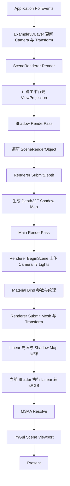
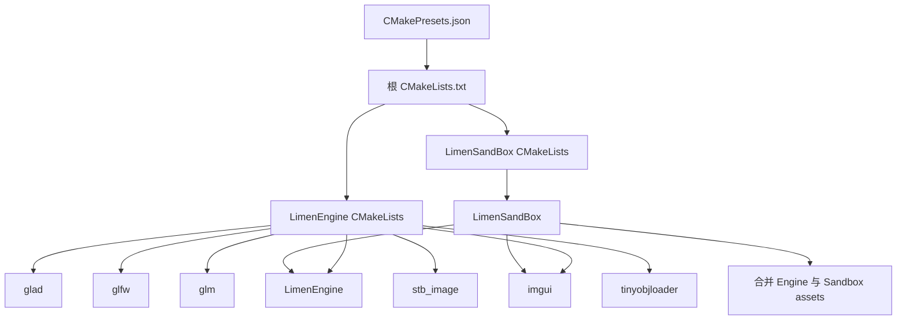
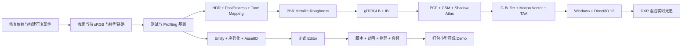

# Limen Engine

Limen Engine 是一个使用 C++20 与 CMake 开发的游戏引擎和现代实时渲染研究项目。

当前阶段以 macOS OpenGL 4.1 后端验证引擎分层、资源管线、光栅化和实时光照；中期重点是 HDR、PBR、glTF、IBL 和稳定实时阴影，之后再进入 Windows Direct3D 12、GPU Driven Rendering 与 NVIDIA DXR 混合实时光追。

本项目的近期目标不是一次性补齐商业引擎的所有模块，而是先形成一套架构清晰、结果可验证、性能可测量的渲染研究引擎，再逐步增加场景编辑与游戏运行时能力。

## 项目里程碑

项目按三个完成节点推进：

1. **Limen Renderer v1**
   - HDR、Tone Mapping、Metallic-Roughness PBR；
   - glTF/GLB、IBL 和稳定实时阴影；
   - 自动化回归与 CPU/GPU Profiling。
2. **Limen Game Engine v1**
   - 可保存和加载的场景；
   - 基础 Editor、脚本、动画、物理、音频与打包；
   - 能够制作一个小型可玩 Demo。
3. **Limen Research Engine v2**
   - Windows Direct3D 12；
   - GPU Driven、时域渲染；
   - DXR 与混合实时光追。

“完成引擎”在本仓库中指完成上述明确里程碑，不代表一次性达到 Unity、Unreal Engine 等商业引擎的功能规模。

## 平台状态

| 操作系统 | 图形 API | 当前状态 | 优先级 |
| --- | --- | --- | --- |
| macOS | OpenGL 4.1 | 已实现，当前唯一可运行后端 | 当前基线 |
| Windows | Direct3D 12 | 尚未实现 | 后续主目标 |
| macOS | Metal | 尚未实现 | 后续方向 |
| Windows | Direct3D 11 | 只有枚举与路径预留 | 非当前主线 |
| Linux | OpenGL / Vulkan | 尚未实现 | 远期方向 |
| iOS / Android | Metal / Vulkan | 尚未实现 | 远期方向 |

`RendererAPI::API` 中存在某个枚举，只表示公共架构预留，不表示对应后端已经可用。当前 CMake 会在 Windows 与 Linux 配置阶段主动报错，避免生成一个无法工作的工程。

## 当前已经具备的能力

### Application 与基础设施

- Application 主循环、Window、Layer 与 Overlay；
- 键盘、鼠标、窗口事件和跨平台键码接口；
- 正交相机、透视相机与相机控制器；
- 日志、断言、`DeltaTime`、`Scope` 与 `Ref`；
- ImGui Dockspace、Scene Viewport、光源参数面板和 Shadow Map 调试显示；
- 静态库、动态库与 Debug/Release CMake Preset；
- Debug 模式下的 ASan 与 UBSan。

### Renderer 与 RHI

- 后端无关的 Buffer、VertexArray、Shader、Texture、UniformBuffer；
- Framebuffer、颜色/深度附件、MSAA 与 Resolve；
- RenderPass 的 Color/Depth/Stencil Load/Store 语义；
- GraphicsPipeline 的拓扑、深度、混合、剔除和正面绕序状态；
- Material 参数表与纹理绑定；
- Mesh、局部 AABB 和索引绘制；
- Renderer2D 批处理、纹理槽切换和自动 Flush；
- SceneRenderer 组织 Shadow Pass 与 Main Pass；
- 环境光、一个主平行光和最多四个点光源；
- 第一版平行光硬阴影。

### Asset、Model 与材质

- Asset 根目录与逻辑路径解析；
- Texture 和 Model 缓存；
- 同一文件按 Linear 与 sRGB 分别缓存 GPU 纹理；
- 默认白纹理与默认平坦法线纹理；
- stb_image 图片解码和 Mipmap 生成；
- OBJ/MTL 导入、多 Shape、多材质槽和 ModelPart；
- 缺失法线生成、平滑组处理；
- Tangent、Bitangent 手性和退化 UV 回退；
- Mesh 与 Model 局部包围盒；
- Albedo 与 Normal Map 的运行时 Material 构建；
- 切线空间 Normal Mapping。

### 当前颜色空间链路

当前 3D 材质遵守以下约定：

```text
sRGB Albedo
    ↓ GPU 纹理采样时自动解码
Linear Albedo
    ↓
Linear 空间中的环境光、漫反射、镜面反射与阴影计算
    ↓
当前 Blinn-Phong Shader 手动执行 Linear → sRGB
    ↓
RGBA8 场景颜色附件 → MSAA Resolve → ImGui Viewport
```

- Albedo 等颜色纹理使用 `TextureColorSpace::SRGB`；
- Normal、Roughness、Metallic 等数据纹理必须使用 `TextureColorSpace::Linear`；
- Alpha 不参与 sRGB 转换；
- 当前输出编码仍在 Blinn-Phong Shader 内，下一阶段会迁移到统一 PostProcess Pass。

## 当前限制

- 场景颜色附件仍是 `RGBA8`，尚无 `RGBA16F`、HDR、曝光和 Tone Mapping；
- 没有统一全屏后处理阶段；
- 阴影只有单平行光硬阴影，没有 PCF、CSM、Shadow Atlas 和点光阴影；
- Scene 句柄仍是 `vector` 下标，不支持删除和 Generation；
- 只支持 OBJ/MTL，不支持 glTF/GLB；
- 没有 AssetID、Asset Registry、热重载、Cooker 和打包格式；
- 没有正式单元测试、CTest、截图回归和 GPU Profiler；
- 当前 ImGui 面板是 Sandbox 调试界面，不是完整 Editor；
- 没有场景序列化、脚本、动画、物理、音频和网络；
- 旧的 `Texture2D::Create(path)` 与 AssetManager 路径仍然并存；
- Direct3D 12 所需的显式命令、描述符、资源状态和同步模型尚未建立。

## 获取、构建与运行

### 环境要求

- macOS；
- 安装在 `/Applications/Xcode.app` 的 Xcode 工具链；
- CMake 4.0 或更高版本；
- Ninja；
- Git；
- 支持 C++20 的 Clang；
- 可用的 macOS OpenGL 4.1 Core Profile。

当前 Preset 硬编码了 Xcode 默认工具链路径，并带有 Darwin 条件，因此不能直接用于 Windows 或 Linux。

### 第三方依赖现状

| 依赖 | 用途 | 当前管理方式 |
| --- | --- | --- |
| GLAD | 加载 OpenGL 函数 | 仓库内普通源码 |
| stb_image | 图片解码 | 仓库内普通源码 |
| GLFW | 窗口、输入、Context | 已登记 Git submodule |
| tinyobjloader | OBJ/MTL 解析 | 已登记 Git submodule |
| GLM | 向量与矩阵 | 当前工作副本存在，但父仓库 gitlink 待修复 |
| ImGui | 编辑器与调试 UI | 当前工作副本存在，但父仓库 gitlink 待修复 |
| spdlog | 日志 | 当前工作副本存在，但父仓库 gitlink 待修复 |

当前 `.gitmodules` 声明了五个 submodule，但 Git index 实际只登记了 GLFW 和 tinyobjloader。也就是说，在修复依赖元数据之前，全新 clone 只执行下面的命令不能保证恢复 GLM、ImGui 和 spdlog：

```bash
git submodule update --init --recursive
```

这是当前构建基础设施的已知问题，已经列入最先执行的开发任务。`scripts/sub_module.sh` 和 `scripts/sub_module.cmd` 是历史初始化脚本，不是可靠替代方案，也不应在已有仓库中重复执行。

### Debug 构建

在依赖已经存在的当前工作副本中，从仓库根目录执行：

```bash
cmake --preset ninja-debug
cmake --build --preset build-debug
```

运行时必须让进程的工作目录位于 `out/`，因为当前 Asset 根目录是相对路径 `assets`：

```bash
(cd out && ./LimenSandBox)
```

不要从仓库根目录直接执行：

```text
./out/LimenSandBox
```

这种写法不会改变进程工作目录，程序会错误地在仓库根目录寻找 `assets/`。

### 日常增量构建

修改 C++ 后：

```bash
cmake --build --preset build-debug
(cd out && ./LimenSandBox)
```

### Preset 与输出目录

| 配置 | Configure Preset | Build Preset | 构建树 | Engine 类型 | Sanitizer |
| --- | --- | --- | --- | --- | --- |
| Debug | `ninja-debug` | `build-debug` | `out/cmake-build-debug-clang17/` | Static | ASan + UBSan |
| Shared Debug | `ninja-shared-debug` | `build-shared-debug` | `out/cmake-build-shared-debug-clang17/` | Shared | ASan + UBSan |
| Release | `ninja-release` | `build-release` | `out/cmake-build-release-clang17/` | Static | 关闭 |

三个配置最终都会输出到：

```text
out/LimenSandBox
```

因此最后一次构建的配置会覆盖之前的同名可执行文件。

### 资源复制与工作目录

`LimenSandBox/CMakeLists.txt` 中的正式 `POST_BUILD` 会依次执行：

```text
LimenEngine/assets    → out/assets
LimenSandBox/assets   → out/assets
```

Engine 资源先复制，Sandbox 资源后复制，因此相同相对路径由 Sandbox 版本覆盖。

只修改 Shader、纹理或模型时，CMake 可能判定可执行目标无需重新链接，从而不会再次执行 `POST_BUILD`。此时从仓库根目录手动刷新两套资源：

```bash
cmake -E copy_directory LimenEngine/assets out/assets
cmake -E copy_directory LimenSandBox/assets out/assets
(cd out && ./LimenSandBox)
```

`copy_directory` 不会删除目标目录中已经失去源文件的旧资源；如果发生资源重命名或删除，应额外检查 `out/assets` 是否残留旧文件。

## 开发脚本

正式构建入口是 CMake Preset。`scripts/` 当前包含辅助脚本和历史脚本：

| 路径 | 实际用途 | 当前状态 |
| --- | --- | --- |
| `scripts/test-shared.sh` | 配置 Shared Debug、检查 `.dylib` 链接并运行数秒 | macOS 冒烟测试；不是 CTest 或画面回归 |
| `scripts/POST_BUILD.sh` | 手动复制 Sandbox assets | 未被 CMake 调用；依赖调用目录；不复制 Engine assets |
| `scripts/sub_module.sh` | 历史 submodule 添加命令 | 非幂等，路径与当前仓库不完全一致，不作为入口 |
| `scripts/sub_module.cmd` | 历史 Windows 初始化尝试 | 当前语法与平台构建均不可用，不作为入口 |
| `scripts/out/` | 本地生成残留目录 | 被忽略，不属于源码或正式构建输出 |

Shared Library 冒烟测试当前应从 `out/` 工作目录启动，以保证运行时能够找到资源：

```bash
(cd out && LIMEN_SHARED_RUN_SECONDS=2 ../scripts/test-shared.sh)
```

该脚本要求 `cmake`、`ninja`、`otool` 和图形桌面会话。它验证动态库生成、链接和短时间进程存活，不证明画面、Shader 或渲染数学正确。

## 当前目录结构

以下只列源码和配置目录，不列 `.idea`、`.DS_Store` 与其他本地生成文件：

```text
Limen-Engine/
├── AGENTS.md
├── CMakeLists.txt
├── CMakePresets.json
├── README.md
├── scripts/
│   ├── test-shared.sh
│   ├── POST_BUILD.sh
│   ├── sub_module.sh
│   └── sub_module.cmd
│
├── LimenEngine/
│   ├── CMakeLists.txt
│   ├── assets/
│   │   └── shaders/OpenGL/
│   │       ├── Renderer2D/
│   │       └── Renderer3D/
│   ├── include/
│   │   ├── Limen.h
│   │   └── Limen/
│   │       ├── Application/
│   │       ├── Asset/
│   │       ├── Core/
│   │       ├── Events/
│   │       ├── Input/
│   │       ├── Math/
│   │       ├── Renderer/
│   │       ├── RHI/
│   │       └── Scene/
│   ├── src/
│   │   ├── Application/
│   │   ├── Asset/
│   │   ├── Core/
│   │   ├── Editor/ImGui/
│   │   ├── Platform/{GLFW,macOS}/
│   │   ├── Renderer/
│   │   ├── RHI/{Common,macOS/OpenGL}/
│   │   └── Scene/
│   └── vendor/
│       ├── glad/
│       ├── glfw/
│       ├── glm/
│       ├── imgui/
│       ├── spdlog/
│       ├── stb_image/
│       └── tinyobjloader/
│
├── LimenSandBox/
│   ├── CMakeLists.txt
│   ├── assets/
│   │   ├── models/
│   │   ├── shaders/OpenGL/{Example2D,Example3D}/
│   │   └── textures/
│   └── src/
│       ├── SandBoxApp.cpp
│       ├── Example3DLayer.*
│       ├── Renderer2DTestLayer.*
│       ├── SandBox2D.*
│       └── ParticleSystem.*
│
└── out/                              # CMake 构建树、程序与运行时资源
```

## 架构分层

```text
Application / Layer / Event / Input
                ↓
Scene / Camera / Light / Asset
                ↓
SceneRenderer / Renderer2D / Renderer
                ↓
RenderPass / Material / Mesh / GraphicsPipeline
                ↓
RHI 公共接口
                ↓
macOS OpenGL 4.1 后端
```

| 模块 | 当前职责 | 不负责什么 |
| --- | --- | --- |
| `Scene` | 保存可渲染对象、Transform 和光源数据 | 不发出 GPU 命令 |
| `SceneRenderer` | 组织 Shadow Pass、Main Pass 和场景提交 | 不解析模型文件 |
| `Renderer` | 准备每帧、每视图、每物体数据并提交 Draw | 不拥有 Scene |
| `RenderPass` | 描述目标、开始、清理、保存、Resolve 和结束 | 不定义材质外观 |
| `Framebuffer` | 拥有颜色、深度和 MSAA 附件 | 不决定使用哪个 Shader |
| `GraphicsPipeline` | 保存 Shader 和固定功能状态 | 不拥有几何资源 |
| `Material` | 保存 Pipeline、材质参数和纹理绑定 | 不拥有场景 Transform |
| `Mesh` | 拥有可绘制几何资源和局部 AABB | 不选择光照模型 |
| `AssetManager` | 路径解析、加载、缓存和默认资源 | 不执行场景渲染 |
| `RendererCommand / RendererAPI` | 转发跨后端渲染命令 | 不理解 Scene 或 Material |

公共接口位于 `LimenEngine/include/Limen/`。OpenGL 原生类型和实现只允许出现在 `LimenEngine/src/RHI/macOS/OpenGL/` 等后端私有目录中。

## Application 生命周期

初始化顺序：

```text
选择 RendererAPI
    ↓
Window + GraphicsContext
    ↓
Renderer::Init
    ↓
AssetManager::Init
    ↓
创建 Layer 与其 GPU 资源
```

销毁顺序：

```text
销毁 Layer
    ↓
AssetManager::Shutdown
    ↓
Renderer::Shutdown
    ↓
销毁 Window + GraphicsContext
```

GPU 资源必须在 GraphicsContext 销毁前释放。

## 当前 3D 帧流程



## CMake 目标关系



- 根 `CMakeLists.txt` 统一设置 C++20、警告、Sanitizer 和静态/动态库选项；
- `LimenEngine/CMakeLists.txt` 收集 Application、Asset、Renderer、Scene、RHI 与平台后端；
- `LimenSandBox/CMakeLists.txt` 构建测试程序并部署运行时资源；
- PCH 只属于 LimenEngine 私有编译优化，公共头文件仍必须自包含。

## 开发执行顺序

测试与 Profiling 不是最后补充的独立阶段，而是从当前基线开始持续伴随所有后续功能。



### 阶段 0A：修复仓库基线

1. 修复 GLM、ImGui、spdlog 的 gitlink 与 `.gitmodules` 一致性；
2. 删除或重写失效的 submodule 初始化脚本；
3. 让资源同步脚本自定位仓库根目录，并统一复制 Engine/Sandbox assets；
4. 保证全新 clone 能通过文档命令构建。

### 阶段 0B：收尾当前渲染改动

1. 构建并运行当前 OBJ、Bounds、Tangent、Normal Mapping 与 sRGB 链路；
2. 验证同一路径的 Linear/sRGB 两份纹理缓存；
3. 验证 Albedo 使用 sRGB，Normal Map 保持 Linear；
4. 迁移剩余 `Texture2D::Create(path)` 调用后再删除旧加载路径；
5. 建立固定测试场景和视觉基线；
6. 完成稳定检查点后再开始 HDR。

### 阶段 1：验证基础设施

1. 为 AABB、法线、切线和路径解析建立 CPU 单元测试；
2. 增加 Shader 编译失败检查；
3. 增加带容差的截图回归；
4. 增加 OpenGL Debug Callback、CPU 帧时间与 GPU Timer Query；
5. 修复只修改资源时部署不更新的问题。

### 阶段 2：HDR 与统一后处理

1. 扩展 Texture/Framebuffer 格式，增加 `RGBA16F`；
2. Main Pass 输出 Linear HDR；
3. 由 `SceneRenderer` 组织独立全屏 PostProcess Pass；
4. 加入 Exposure 与 Tone Mapping；
5. 在最终输出位置执行唯一一次 Linear → sRGB；
6. 删除 Blinn-Phong Shader 内的临时输出编码。

### 阶段 3：PBR Metallic-Roughness

1. 定义 Base Color、Metallic、Roughness、Normal、AO、Emissive 语义；
2. 明确每种纹理的颜色空间与默认纹理；
3. 实现 Cook-Torrance BRDF；
4. 建立标准材质球测试场景；
5. 保留 Blinn-Phong 作为教学和回归对照，而不是直接删除。

### 阶段 4：glTF/GLB 与 IBL

1. 选择只负责解析的 glTF 第三方库；
2. 转换为 Limen 自有 Model、Mesh、Material 和 Texture；
3. 支持节点层级、PBR 材质和切线数据；
4. 加入环境贴图、Diffuse Irradiance、Prefilter 与 BRDF LUT；
5. 使用公开标准 glTF 测试模型验证。

### 阶段 5：阴影升级

1. PCF；
2. 稳定的平行光阴影范围；
3. Cascaded Shadow Maps；
4. Shadow Atlas 与多光源阴影预算；
5. 根据需求增加点光与聚光阴影。

### 阶段 6：Scene、资源与序列化

1. Generation Handle 与安全删除；
2. Entity、Transform 层级和 Render/Camera/Light 组织；
3. 场景序列化与反序列化；
4. AssetID、Registry、依赖关系和热重载基础；
5. 先保持最小数据模型，不提前引入复杂 ECS 和 Job System。

### 阶段 7：正式 Editor

1. Hierarchy；
2. Inspector；
3. Content Browser；
4. Picking 与 Transform Gizmo；
5. Undo/Redo；
6. Edit/Play 状态。

### 阶段 8：可玩运行时

1. 输入映射；
2. Prefab；
3. 脚本；
4. 骨骼动画；
5. 基础物理；
6. 音频；
7. 简单游戏 UI；
8. 资源打包与可发布 Demo。

### 阶段 9：现代实时渲染

1. G-Buffer 与 Deferred/Hybrid 路径；
2. Motion Vector；
3. TAA；
4. Frustum/Occlusion Culling；
5. GPU Profiling；
6. GPU Driven Rendering；
7. Pass 数量和资源依赖足够复杂后，再评估 Render Graph。

### 阶段 10：Windows Direct3D 12

1. Windows 构建与 Window/SwapChain；
2. Device、Queue、Command Allocator/List；
3. Fence 与 Frames in Flight；
4. RTV、DSV、SRV、CBV Descriptor；
5. Resource State 与 Barrier；
6. Upload Heap 与资源生命周期；
7. DXC、HLSL、Root Signature 与 PSO；
8. 按清屏、三角形、Main Pass、Shadow、PBR、Renderer2D 顺序与 OpenGL 对齐。

### 阶段 11：DXR 与混合实时光追

1. BLAS/TLAS；
2. Raytracing Pipeline；
3. Shader Table；
4. 光追阴影或反射的第一个混合效果；
5. 时域累积与降噪；
6. 后续研究 ReSTIR、混合 GI 和多光源预算。

## 时间估算

下面按单人、边学习边实现估算。一个“有效开发日”按约 5 小时专注工作计算，包含设计、编码、调试、验证和文档。

| 阶段                              | 可验证第一版 |         稳定可复用版本 |
|-----------------------------------|-------------:|-----------------------:|
| 0A. 依赖与脚本可复现性            |   0.5–1.5 天 |                 2–3 天 |
| 0B. 当前 sRGB、Normal、OBJ 收尾   |       1–2 天 |                 3–5 天 |
| 1. 测试与 Profiling 基线          |       3–6 天 |                 2–3 周 |
| 2. HDR、PostProcess、Tone Mapping |       4–8 天 |                 2–3 周 |
| 3. Metallic-Roughness PBR         |      8–15 天 |                 3–5 周 |
| 4. glTF/GLB 与 IBL                |     10–20 天 |               1–2 个月 |
| 5. PCF、CSM、Shadow Atlas         |     12–25 天 |               2–4 个月 |
| 6. Entity、序列化、AssetID        |     15–30 天 |               2–3 个月 |
| 7. 正式 Editor                    |     20–40 天 |               3–6 个月 |
| 8. 脚本、动画、物理、音频、打包   |     35–70 天 |              6–12 个月 |
| 9. G-Buffer、TAA、GPU Driven      |     30–60 天 |               4–8 个月 |
| 10. Windows Direct3D 12           |     40–80 天 |              6–12 个月 |
| 11. DXR 与混合实时光追            |     30–70 天 | 持续研究，约 6–18 个月 |

这些区间不是交付承诺。图形错误定位、平台驱动差异、第三方库选择和功能范围变化都可能显著影响时间；稳定版本中的测试、Profiling 和工具建设也会与后续阶段重叠，不应简单机械相加。

大致日历时间：

| 里程碑                   |     全职开发 | 每天约 2–3 小时 |
|--------------------------|-------------:|----------------:|
| Limen Renderer v1        |  约 3–5 个月 |    约 6–12 个月 |
| Limen Game Engine v1     | 约 8–15 个月 |     约 1.5–3 年 |
| Limen Research Engine v2 |  约 1.5–3 年 |       约 3–5 年 |

## 当前最先执行的清单

在增加新渲染效果前，按以下顺序执行：

1. 修复依赖 gitlink 与 submodule 初始化流程；
2. 整理或替换 `scripts/` 中失效、依赖工作目录的脚本；
3. 完成当前工作区的 Debug 构建和运行验证；
4. 验证 Linear/sRGB 双缓存和纹理语义；
5. 建立最小颜色空间与 Normal Mapping 回归场景；
6. 迁移剩余旧纹理加载入口；
7. 建立测试与 GPU 调试基线；
8. 设计 `RGBA16F` 附件和 PostProcess 所有权；
9. 实现 HDR Main Pass；
10. 实现 Tone Mapping，并把最终 sRGB 编码集中到 PostProcess。

在这十项完成前，不提前进入 PBR、DX12 或 DXR。

## 暂不阻塞当前主线的功能

以下功能有价值，但不是 Limen Renderer v1 的前置条件：

- 网络与多人同步；
- 大型通用 ECS；
- 复杂 Job System；
- Linux/Vulkan、移动端；
- Virtual Shadow Maps；
- ReSTIR、Path Tracing 和神经渲染。

它们应在真实瓶颈和研究目标出现后再立项，而不是提前加入当前架构。

## 协作与代码边界

仓库协作、教学顺序、代码修改授权和架构约束见 [`AGENTS.md`](AGENTS.md)。核心原则包括：

- `Scene` 只保存数据；
- `SceneRenderer` 组织场景 Pass；
- Renderer 与公共 RHI 不暴露 OpenGL、Direct3D 12 或 Metal 原生类型；
- 第三方解析库只负责解析，最终转换成 Limen 自有资源；
- GPU Context 销毁前必须先释放所有 GPU 资源；
- 每个新功能都需要编译验证、最小测试场景和明确的预期结果。

## License

本项目使用 Apache License 2.0，详见 [`LICENSE`](LICENSE)。
